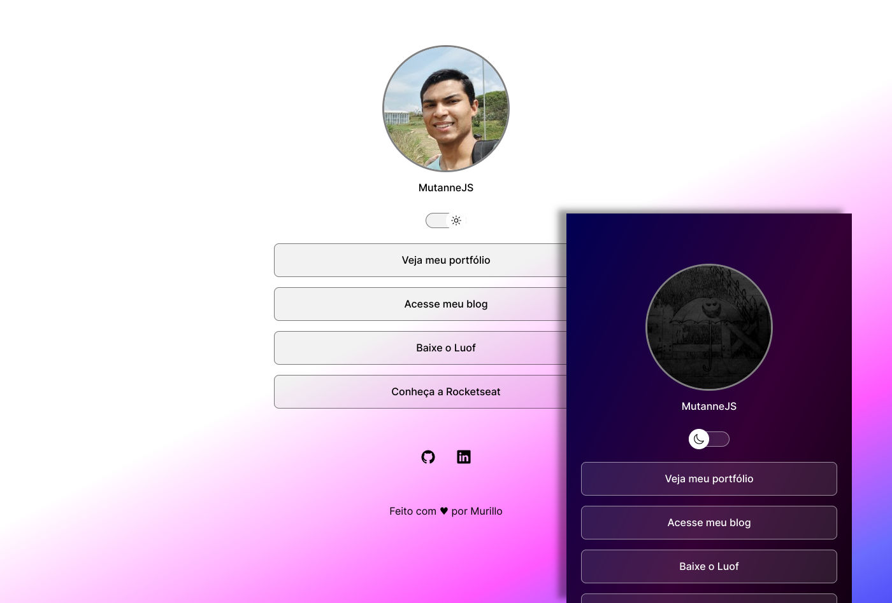

<h1 align="center"> DevLinks </h1>

O DevLinkks é um agregador de links para usar como cartão de visitas online.

  <a href="#-projeto">Projeto</a>&nbsp;&nbsp;&nbsp;|&nbsp;&nbsp;&nbsp;
  <a href="#-tecnologias">Tecnologias</a>&nbsp;&nbsp;&nbsp;|&nbsp;&nbsp;&nbsp;
  <a href="#-ferramentas">Ferramentas</a>&nbsp;&nbsp;&nbsp;|&nbsp;&nbsp;&nbsp;
  <a href="#memo-licença">Licença</a>

  

 

## 💻 Projeto

Esse projeto foi baseado nas aulas da **[Rocketseat](https://www.rocketseat.com.br/)**.

Possui pequenas mudanças em comparação com o projeto base, incluindo:

- No lugar de imagens no background foi utilizado um gradiente de cores
- Os links possuem uma explicação sobre o que se referem, possível de ver ao deixar o mouse em cima deles
- As imagens usada no botão de mudar o tema são diferentes (baixadas a partir do site https://ionic.io/ionicons)
- A página possui um favicon

Para acessar esse projeto finalizado e online, clique [aqui](https://mutannejs.github.io/MurilloDevLinks/).

## 🚀 Tecnologias

- HTML e CSS
- JavaScript
- Git e GitHub
- Figma

## :ledger: Ferramentas

Durante o desenvolvimento foi utilizado os seguintes editores de texto:

- [Geany](https://www.geany.org/)
- [Fronteditor](https://github.com/maykbrito/fronteditorv2)

Foi usado também o [Gimp](https://www.gimp.org/) para criar a preview do README.

## :memo: Licença

Esse projeto está sob a licença MIT.
